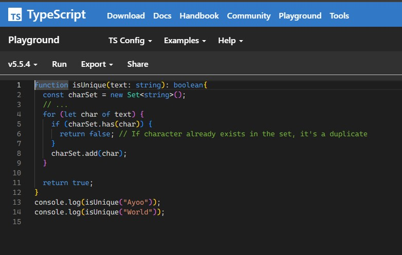

As someone with experience in JavaScript and some of its variations like the p5 coding environment, diving into TypeScript was jarring yet familiar. TypeScript shares the same fundamental logic as JavaScript, yet its syntax and type-checking bring a new level of complexity to even simple problems. Initially, I found myself pausing to consider coding choices that, in JavaScript, would have been automatic. This need for careful consideration forced me to approach coding in a more strategic manner, which, while challenging, was also refreshing. TypeScript, to me, isn't inherently better than any other language I've worked with so far, but it’s certainly different enough to warrant deeper exploration.

One of the most interesting aspects of working with TypeScript was how it impacted my performance during the timed practice WODs. Normally, I work through larger tasks with deadlines stretching over hours or days, but these timed WODs were much more immediate. Even though the problems themselves were relatively simple, working in an unfamiliar language slowed me down and revealed weaknesses in my learning speed and coding efficiency. It was a slightly humbling experience but also valuable. I realized how quickly small differences in syntax could derail my flow, and this pushed me to improve my learning process. Despite this, I performed better than expected under pressure, which was motivating. It reminded me of the importance of being adaptable when tackling new languages or tasks, especially under time constraints. 

The concept of "athletic software engineering" really clicked with me during this process. The timed WODs introduced a new kind of stress that I hadn't experienced before, but it was a productive kind of stress—one that pushed me to be faster and more efficient. In my future career, whatever it may be, hopefully involved with software development, I know that speed will be crucial, whether I'm solving problems in real-time, working to meet a tight deadline, and especially to be competitive in the overall job market. This practice of working under pressure is preparing me for that reality. While it's challenging now, I'm excited to continue improving my speed and productivity through this method. The opportunity to identify my weak spots and turn them into strengths is an exciting challenge, and I look forward to mastering this approach as I progress.

