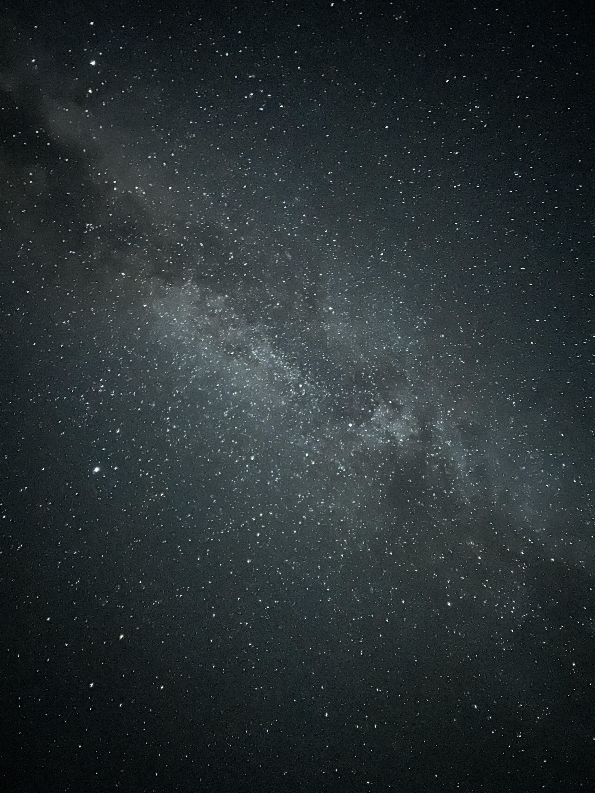
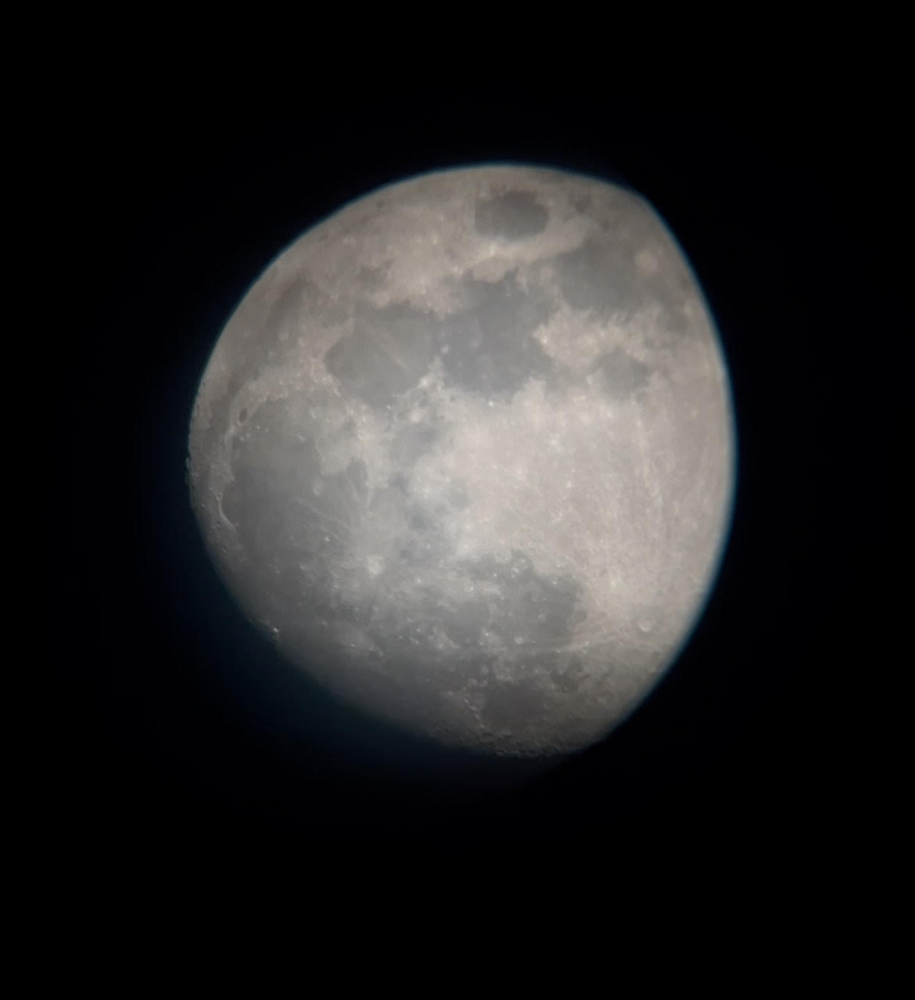
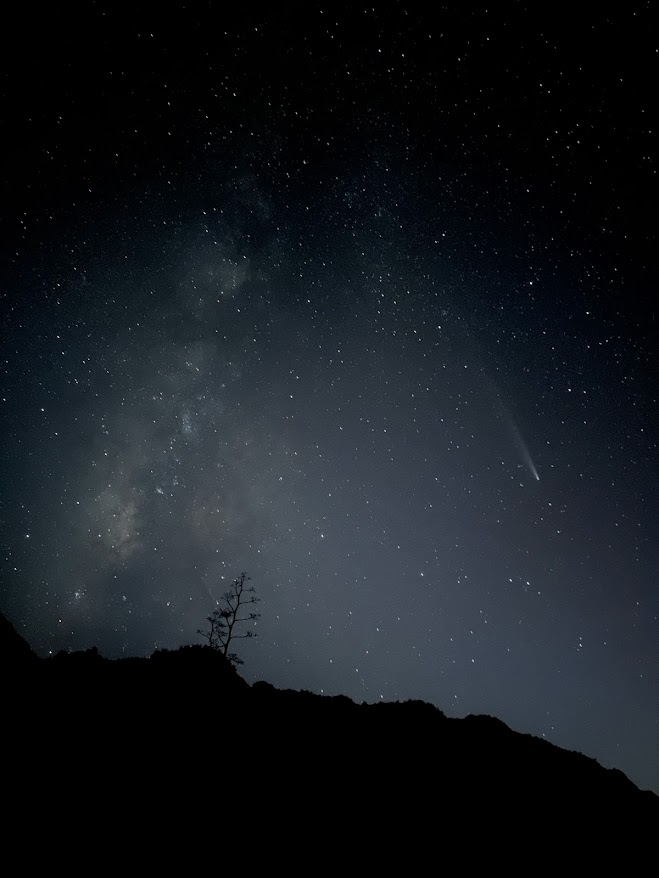
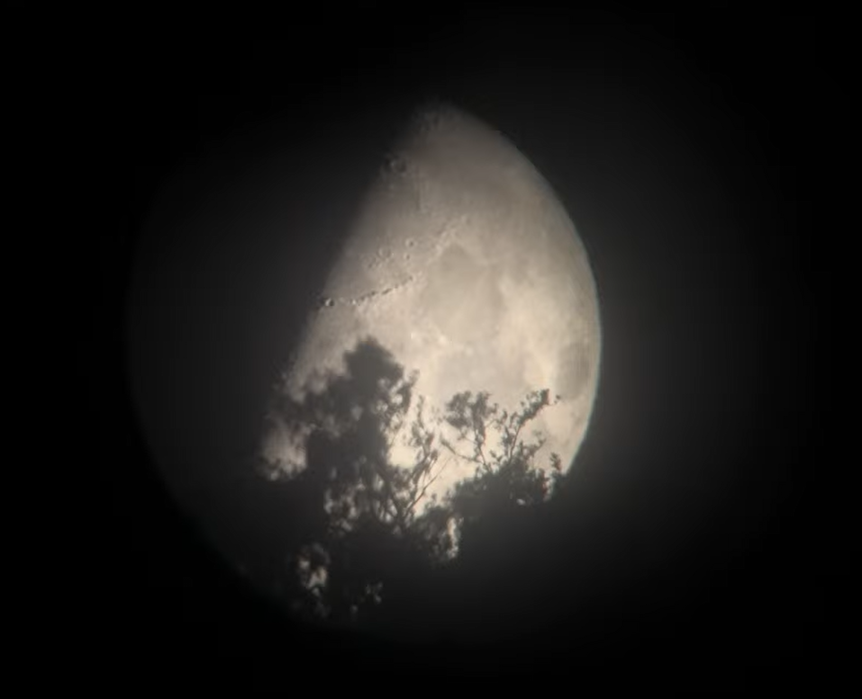

Astrophotography is an ongoing passion of mine, here are a small sample of what I am most proud of:

At the moment the only camera I have accsess to is my Iphone 16, so I make do. That camera is decently equiped to do wide view long exposure so I am pretty happy with my Milky Way long expures. However I do also do wide view long exposures when photographing constellations as well as my first few attempt at capturing the Andromeda galaxy. I have a telescope that I've thrown together from spare parts but has surprised me time and time again. It can make daziling observations of the moon at 2 differant magnification levels (the picture above is the less magnified lense) and I've even been able to view Jupiter and it's moons although theyre admittedly very low resoultion. I have to take pictures with my Iphone through the eyepeice so my photos aren't the best but they'll only get exponentially better from here and the struggle I go through now will be satisfying to look back at once I have a better setup. I did invest in a new telescope so stay tuned for an exciting step in my astrophotography journey soon.

