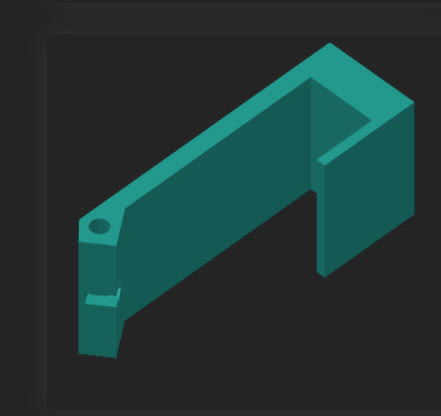
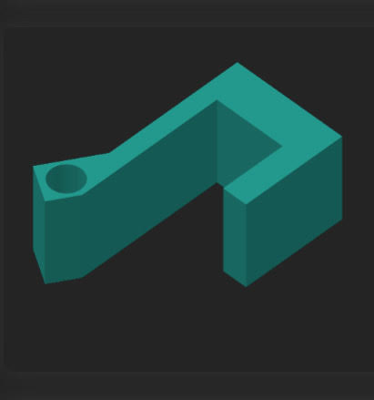

  
  

I am teaching myself the interative design process. 
I actually have no formal 3d modelling education but it's something I've always wanted to learn. Adjacently, I've always known that the best way for myself to learn is passion projects, thankfully I have finally brought these 2 facts together. Now that I have accsess to 3d printers of quality I am teaching myself Blender and Fusion360 for a variety of projects. One of them I have been making version after version to make the most effective tool possible. I sleep on a futon that's not the easiest to fold into a couch, but seen at the top of this project is the first few versions(I could only find pictures of version 3 and 4 for now). These models are absolutely not impressive by themselves, but what I'm proud of is what I've learned through each version which may not be apparent. I have been making predictions, printing, testing, making measurments, redesigning, and repeating, which has been extremely catherdic. I know this might be basic for engineers, but most of my experiance is in coding which mostly involved debugging, but this is making me look at the design process entirely differant.
