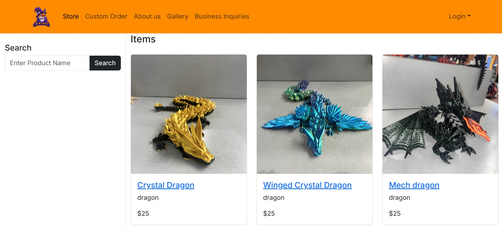
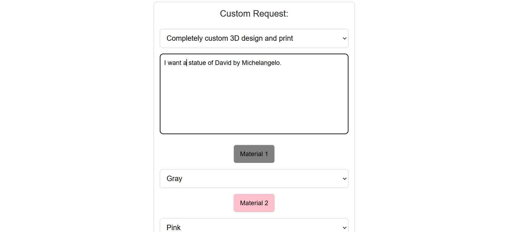
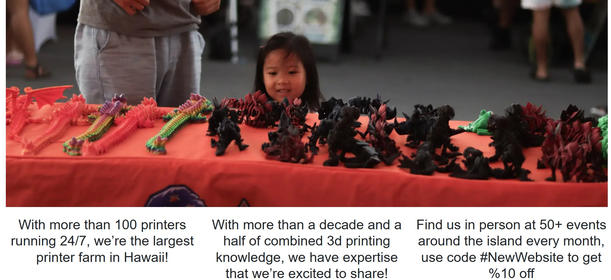

For my ICS314 final my groupmates and I created a solid first draft of a webstore that I think will drastically help the small buisness I am a part of called 3D-Wizards Inc. streamline and add consistancy to our revenue stream.

3D-Wizards Inc. is a business that develops and sells 3D printed products. The web application for the online store is currently under development, but the final application will allows users to browse items, make orders, and get in contact with the business owners.

The Problem: For the past year we have been a popular staple of physical marketplaces like the Aloha Stadium Swap Meet, the Lineup at Wai Kai, and the Pearlridge Center just to name a few. However we have a disappointingly finite stock and variety of options. In theory we should be able to quickly turn around custom orders, especially custom colors of products we already produce, due to the nature of 3D printers. However we’re so focused on having enough normal stock for our locations that we don’t have time to check and respond to instagram DM’s or emails with lucrative custom orders. People also are unclear about their options when it comes to what we regularly make and how to order in bulk.

The Solution: We want to build my company a website where prospective customers can easily put in orders, with an admittedly overwhelming number of custom options, in a welming user-interface.

The main componants that will make this site useful are the store page which will allow customers to view our currently availible products and purcase them from their homes,

the custom order page which will let people with little to no 3D printing experiance still benefit creatively with the aid of our expertice,

and the rest of the pages will support our buisnesses image as one that is excited to collaborate and grow as a part of the community.

I will continue to work on this project until it is a viable project.